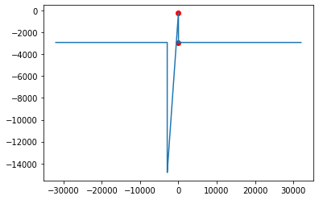

#### «Национальный исследовательский университет ИТМО»
### Основы профессиональной деятельности
## Лабораторная работа 4
## Вариант 3002
### Бутвин Михаил, P3130
###  2023

<div style="clear: both; page-break-after: always;"></div>

-------

## Source

| Address | Value | Mnemonic        | Comment                                |
| ------- | ----- | --------------- | -------------------------------------- |
| 0CF     | 0200  | CLA             | Clear acc                              |
| 0D0     | EE19  | ST E            | Store acc to E (E = 0)                 |
| 0D1     | AE16  | LD A            | Load A to acc                          |
| 0D2     | 0700  | INC             | Increment acc                          |
| 0D3     | 0C00  | PUSH            | Push acc to stack                      |
| 0D4     | D660  | CALL FOO        | Call subroutine at Foo                 |
| 0D5     | 0800  | POP             | Pop acc from stack                     |
| 0D6     | 0740  | DEC             | Decrement acc                          |
| 0D7     | 6E12  | SUB E           | Subtract E from acc                    |
| 0D8     | EE11  | ST E            | Store acc to E                         |
| 0D9     | AE0F  | LD B            | Load B to acc                          |
| 0DA     | 0740  | DEC             | Decrement acc                          |
| 0DB     | 0C00  | PUSH            | Push acc to stack                      |
| 0DC     | D660  | CALL FOO        | Call subroutine at Foo                 |
| 0DD     | 0800  | POP             | Pop acc from stack                     |
| 0DE     | 6E0B  | SUB E           | Subtract E from acc                    |
| 0DF     | EE0A  | ST E            | Store acc to E                         |
| 0E0     | AE06  | LD C            | Load C to acc                          |
| 0E1     | 0C00  | PUSH            | Push acc to stack                      |
| 0E2     | D660  | CALL FOO        | Call subroutine at Foo                 |
| 0E3     | 0800  | POP             | Pop acc from stack                     |
| 0E4     | 4E05  | ADD E           | Add E to acc                           |
| 0E5     | EE04  | ST E            | Store acc to E                         |
| 0E6     | 0100  | HLT             | Stop program                           |
| 0E7     | ZZZZ  | C               | Input variable                         |
| 0E8     | XXXX  | A               | Input variable                         |
| 0E9     | YYYY  | B               | Input variable                         |
| 0EA     | 0994  | E               | Result E                               |
|         |       | FOO:            |                                        |
| 660     | AC01  | LD (ST + 1)     | Load argument from stack to acc        |
| 661     | F001  | BZS MUL_AND_SUB | Jump to MUL_AND_SUB if acc is zero     |
| 662     | F308  | BNC RETURN_X    | Jump to RETURN_X if acc is positive    |
|         |       | MUL_AND_SUB:    |                                        |
| 663     | 7E0A  | CMP X           | Compare acc with E                     |
| 664     | F806  | BLT RETURN_X    | Jump to RETURN_X if acc is less than X |
| 665     | F005  | BZS RETURN_X    | Jump to RETURN_X if acc is equal to X  |
| 666     | 0500  | ASL             | Multiply accumulator by 2              |
| 667     | 0500  | ASL             | Multiply accumulator by 2              |
| 668     | 4C01  | ADD (ST + 1)    | Add argument to acc                    |
| 669     | 6E05  | SUB Y           | Subtract Y from acc                    |
| 66A     | CE01  | JUMP RETURN     | Jump to RETURN                         |
|         |       | RETURN_X:       |                                        |
| 66B     | AE02  | LD (IP + 2)     | Load X to acc                          |
|         |       | RETURN          |                                        |
| 66C     | EC01  | ST (ST + 1)     | Store acc to argument                  |
| 66D     | 0A00  | RET             | Return from subroutine                 |
| 66E     | F498  | X               | Constant X                             |
| 66F     | 00E8  | Y               | Constant Y                             |

## Description

```python
def foo(arg):
    X = -2920
    Y = 232

    if arg == 0:
        return -Y

    if arg > 0 or arg <= X:
        return X

    return arg * 5 - Y


a = int(input())
b = int(input())
c = int(input())

e = foo(c) + foo(b - 1) - foo(a + 1) + 1

print(e)
```

## Data representation and available values

### Input:

**A** - 16-bit signed integer 

```python
if A == -1:
    return (A == -1)
elif A > -1:
    return (-1 < A <= MAXINT - 1)
elif A <= -2921:
    return (MININT <= A <= -2921)
else:
    MININT <= (A * 5 - 227) <= MAXINT
```


**B** - 16-bit signed integer

```python
if B == 1:
    return (B == 1)
elif B > 1:
    return (1 < B <= MAXINT)
elif B <= -2919:
    return (MININT + 1 <= B <= -2919)
else:
    MININT <= (B * 5 - 237) <= MAXINT
```


**C** - 16-bit signed integer

```python
if C == 0:
    return (C == 0)
elif C > 0:
    return (0 < C <= MAXINT)
elif C <= -2920:
    return (MININT  <= C <= -2920)
else:
    MININT <= (C * 5 - 232) <= MAXINT
```

**foo** - 16-bit signed integer

```python
if arg == 0:
    return (-232)
elif arg > 0 or arg <= -2920:
    return (-2920)
else:
    return (MININT <= result <= -232)
```



### Output:

**E** - 16-bit signed integer


### Trace

| Addr | Value | IP  | CR   | AR  | DR   | SP  | BR   | AC   | PS  | NZVC | Addr | Value |
| ---- | ----- | --- | ---- | --- | ---- | --- | ---- | ---- | --- | ---- | ---- | ----- |
| 004  | 0200  | 004 | 0000 | 000 | 0000 | 000 | 0000 | 0000 | 004 | 0100 |      |       |
| 004  | 0200  | 005 | 0200 | 004 | 0200 | 000 | 0004 | 0000 | 004 | 0100 |      |       |
| 005  | EEFD  | 006 | EEFD | 003 | 0000 | 000 | FFFD | 0000 | 004 | 0100 | 003  | 0000  |
| 006  | AEF9  | 007 | AEF9 | 000 | F2FB | 000 | FFF9 | F2FB | 008 | 1000 |      |       |
| 007  | 0700  | 008 | 0700 | 007 | 0700 | 000 | 0007 | F2FC | 008 | 1000 |      |       |
| 008  | 0C00  | 009 | 0C00 | 7FF | F2FC | 7FF | 0008 | F2FC | 008 | 1000 | 7FF  | F2FC  |
| 009  | DE76  | 080 | DE76 | 7FE | 000A | 7FE | 0080 | F2FC | 008 | 1000 | 7FE  | 000A  |
| 080  | AC01  | 081 | AC01 | 7FF | F2FC | 7FE | 0001 | F2FC | 008 | 1000 |      |       |
| 081  | F001  | 082 | F001 | 081 | F001 | 7FE | 0081 | F2FC | 008 | 1000 |      |       |
| 082  | F308  | 083 | F308 | 082 | F308 | 7FE | 0082 | F2FC | 008 | 1000 |      |       |
| 083  | 7E0A  | 084 | 7E0A | 08E | F498 | 7FE | 000A | F2FC | 008 | 1000 |      |       |
| 084  | F806  | 08B | F806 | 084 | F806 | 7FE | 0006 | F2FC | 008 | 1000 |      |       |
| 08B  | AE02  | 08C | AE02 | 08E | F498 | 7FE | 0002 | F498 | 008 | 1000 |      |       |
| 08C  | EC01  | 08D | EC01 | 7FF | F498 | 7FE | 0001 | F498 | 008 | 1000 | 7FF  | F498  |
| 08D  | 0A00  | 00A | 0A00 | 7FE | 000A | 7FF | 008D | F498 | 008 | 1000 |      |       |
| 00A  | 0800  | 00B | 0800 | 7FF | F498 | 000 | 000A | F498 | 008 | 1000 |      |       |
| 00B  | 0740  | 00C | 0740 | 00B | 0740 | 000 | 000B | F497 | 009 | 1001 |      |       |
| 00C  | 6EF6  | 00D | 6EF6 | 003 | 0000 | 000 | FFF6 | F497 | 009 | 1001 |      |       |
| 00D  | EEF5  | 00E | EEF5 | 003 | F497 | 000 | FFF5 | F497 | 009 | 1001 | 003  | F497  |
| 00E  | AEF2  | 00F | AEF2 | 001 | 000D | 000 | FFF2 | 000D | 001 | 0001 |      |       |
| 00F  | 0740  | 010 | 0740 | 00F | 0740 | 000 | 000F | 000C | 001 | 0001 |      |       |
| 010  | 0C00  | 011 | 0C00 | 7FF | 000C | 7FF | 0010 | 000C | 001 | 0001 | 7FF  | 000C  |
| 011  | DE6E  | 080 | DE6E | 7FE | 0012 | 7FE | 0080 | 000C | 001 | 0001 | 7FE  | 0012  |
| 080  | AC01  | 081 | AC01 | 7FF | 000C | 7FE | 0001 | 000C | 001 | 0001 |      |       |
| 081  | F001  | 082 | F001 | 081 | F001 | 7FE | 0081 | 000C | 001 | 0001 |      |       |
| 082  | F308  | 08B | F308 | 082 | F308 | 7FE | 0008 | 000C | 001 | 0001 |      |       |
| 08B  | AE02  | 08C | AE02 | 08E | F498 | 7FE | 0002 | F498 | 009 | 1001 |      |       |
| 08C  | EC01  | 08D | EC01 | 7FF | F498 | 7FE | 0001 | F498 | 009 | 1001 | 7FF  | F498  |
| 08D  | 0A00  | 012 | 0A00 | 7FE | 0012 | 7FF | 008D | F498 | 009 | 1001 |      |       |
| 012  | 0800  | 013 | 0800 | 7FF | F498 | 000 | 0012 | F498 | 009 | 1001 |      |       |
| 013  | 6EEF  | 014 | 6EEF | 003 | F497 | 000 | FFEF | 0001 | 001 | 0001 |      |       |
| 014  | EEEE  | 015 | EEEE | 003 | 0001 | 000 | FFEE | 0001 | 001 | 0001 | 003  | 0001  |
| 015  | AEEC  | 016 | AEEC | 002 | FFEE | 000 | FFEC | FFEE | 009 | 1001 |      |       |
| 016  | 0C00  | 017 | 0C00 | 7FF | FFEE | 7FF | 0016 | FFEE | 009 | 1001 | 7FF  | FFEE  |
| 017  | DE68  | 080 | DE68 | 7FE | 0018 | 7FE | 0080 | FFEE | 009 | 1001 | 7FE  | 0018  |
| 080  | AC01  | 081 | AC01 | 7FF | FFEE | 7FE | 0001 | FFEE | 009 | 1001 |      |       |
| 081  | F001  | 082 | F001 | 081 | F001 | 7FE | 0081 | FFEE | 009 | 1001 |      |       |
| 082  | F308  | 083 | F308 | 082 | F308 | 7FE | 0082 | FFEE | 009 | 1001 |      |       |
| 083  | 7E0A  | 084 | 7E0A | 08E | F498 | 7FE | 000A | FFEE | 001 | 0001 |      |       |
| 084  | F806  | 085 | F806 | 084 | F806 | 7FE | 0084 | FFEE | 001 | 0001 |      |       |
| 085  | F005  | 086 | F005 | 085 | F005 | 7FE | 0085 | FFEE | 001 | 0001 |      |       |
| 086  | 0500  | 087 | 0500 | 086 | FFEE | 7FE | 0086 | FFDC | 009 | 1001 |      |       |
| 087  | 0500  | 088 | 0500 | 087 | FFDC | 7FE | 0087 | FFB8 | 009 | 1001 |      |       |
| 088  | 4C01  | 089 | 4C01 | 7FF | FFEE | 7FE | 0001 | FFA6 | 009 | 1001 |      |       |
| 089  | 6E05  | 08A | 6E05 | 08F | 00E8 | 7FE | 0005 | FEBE | 009 | 1001 |      |       |
| 08A  | CE01  | 08C | CE01 | 08A | 008C | 7FE | 0001 | FEBE | 009 | 1001 |      |       |
| 08C  | EC01  | 08D | EC01 | 7FF | FEBE | 7FE | 0001 | FEBE | 009 | 1001 | 7FF  | FEBE  |
| 08D  | 0A00  | 018 | 0A00 | 7FE | 0018 | 7FF | 008D | FEBE | 009 | 1001 |      |       |
| 018  | 0800  | 019 | 0800 | 7FF | FEBE | 000 | 0018 | FEBE | 009 | 1001 |      |       |
| 019  | 4EE9  | 01A | 4EE9 | 003 | 0001 | 000 | FFE9 | FEBF | 008 | 1000 |      |       |
| 01A  | EEE8  | 01B | EEE8 | 003 | FEBF | 000 | FFE8 | FEBF | 008 | 1000 | 003  | FEBF  |
| 01B  | 0100  | 01C | 0100 | 01B | 0100 | 000 | 001B | FEBF | 008 | 1000 |      |       |
